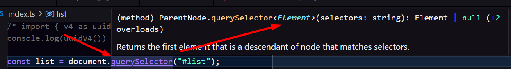
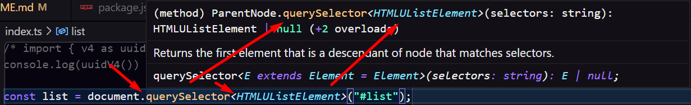
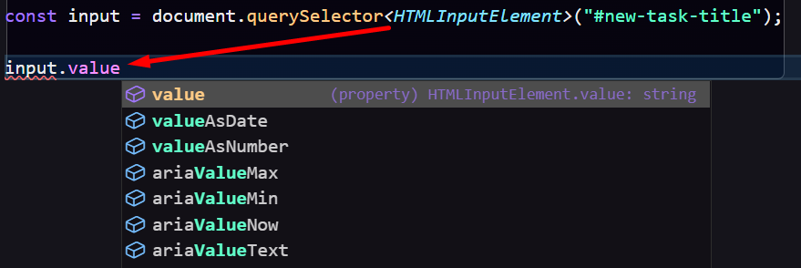
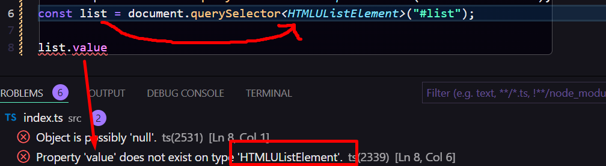
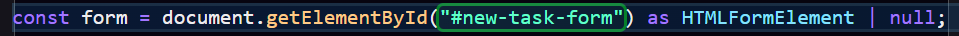
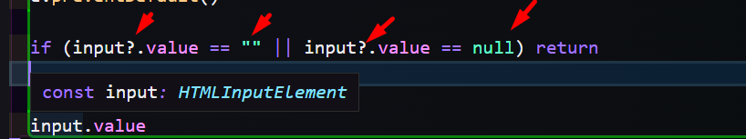
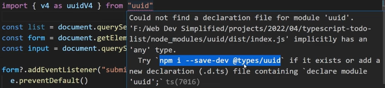
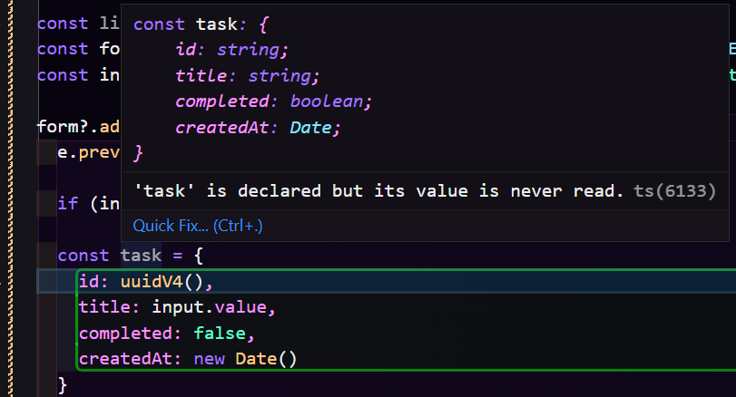
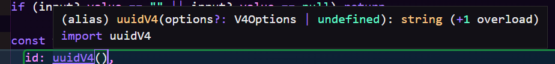

## Projeto To-Do List em Typescript

Projeto criado para reforçar conceitos em TypeScript

Etapas do Projeto:

- Setup do Typescript
- Bundle Typescript
- Criando o Projeto

### Introdução

**tsconfig.json**

*Algumas configurações iniciais do TypeScript que foram apresentadas*

- outDir : Serve para compilar o seu arquivos TypeScript e escolher uma pasta de destino aonde vai estar o arquivo .js compilado

- module : Serve para informar qual modulo de código ira ser compilado
    Nesse caso alteramos de "commonjs" para "es6" afim de ele conseguir usar as funções de export, caso eu esteja utilizando alguma lib de node_modules

**MAS** temos um grande porém, pois o navegador não sabe utilizar a pasta de node_modules, então para resolver esse problema, iremos utilizar o conceito de Bundle, temos varios Bundle para ser utilizado com o TypeScript

Então nesse mini-projeto iremos utilizar o **Bundle Snowpack**

No terminal:
```
npx create-snowpack-app . --template @snowpack/app-template-blank-typescript
``` 
Explicando o código:
"npx create-snowpack-app" : Estamos criado o nosso projeto com o bundle do snowpack;

"." : Vai ser criado no diretório atual;

"--template": Utilizando a flag para especificar um modelo e após isso declaramos que utilizamos o modelo em branco do typescript;

Verificamos que após a instalação do bundle, ao inspecionar elemento no navegador não ocorre mais erro sobre export e conseguimos utilizar o typescript e todo seu poder


<> Tipagem no Typescript

Pois por exemplo em nosso projeto precisamos informar ao typeScript que em nosso document.querySelector estamos pegando uma tag de ui em list e dois input antes de fazer query no elemento HTML

Antes da tipagem:


Depois da tipagem:


Iremos definir isso para nosso outros dois elementos como:

- HTMLFormElement
- HTMLInputElement


Após essas pequenas mudanças, faz **UMA GRANDE DIFERENÇA** no dia-a-dia de um projeto pois agora o Typescript sabe quais são os tipos de varíaveis e assim o mesmo disponibiliza métodos específicos de acordo com o seu tipo, ou seja, para o input existe o método de value ja para a list não, pois é disponibilizado de acordo com o seu tipo

Exemplo:






Mas nem todas as funções consegue receber essas funções genéricas

Mas também podemos utilizar o **as** para dizer exatamente o que é para o TypeScript e também podemos informar caso esse valor chegue nulo, iremos utilizar no nosso formulário de task



Quando executamos algum tipo de QuerySelector o typescript sempre implica de você tratar a condição nula, pois tratando se da uma query, você sempre tem a chance de esse valor chega como NULO, uma das formas mais simples que podemos tratar esse cenário é utilizando o "?", que é conhecido como *Optional Chaining*

Temos uma pecualiridade do Typescript após isso, pois conforme analisamos a imagem não existe mais o underline, pois devido a tratativa acima de verificar se os valores de input estão nulos ou vazios, o próprio TypeScript sabe que é impossível esse valor chega como nulo devido a tratativa do If acima



Criamos nossa função de task, mas verificamos que nosso id é o unico que não esta tipado, **o seu valor retorna como Any**, ou seja, nesse caso, temos que lembrar que nem todas as libs não possuem tipagem nativa, mas podemos nesse caso do uuid baixar o seu @types e assim utilizar ele, para saber se você pode ter uma lib disponível basta colocar o mouse encima do underline de erro do uuid em sua declaração inicial

Tipagem da task:


Vejamos que temos a opção de baixar o @types para a lib do uuid, com *@types/uuid*


Após a instalação, podemos agora verificar nosso id com o Type dele em v4 da nossa lib do uuid



Nem todas as bibliotecas possuem esses tips para baixar, no caso, se houver disponível é necessário você mesmo fazer a tipagem para evitar esses erros do Typescript


Alguns links de referência para explicar sobre Tipagem e Generics no Typescript e funções do Javascript
- [Tipagem no Typescript](https://www.treinaweb.com.br/blog/tipagem-no-typescript)
- [Entendendo Generics por completo](https://oieduardorabelo.medium.com/typescript-entendendo-generics-por-completo-40a372aeea5)

- [5 Funções em JavaScript que são poucas conhecidas](https://www.youtube.com/watch?v=v2tJ3nzXh8I)


[Projeto do Canal do Youtube - Web Dev Simplified](https://www.youtube.com/watch?v=jBmrduvKl5w)

